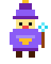
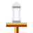
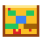
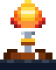

<div align="center">

<!-- ─────────────────────────  HERO  ───────────────────────── -->


<br/>



<br/><br/>

[](https://git.io/typing-svg)

<br/>


</div>

---

<!-- ────────────────────  CHOOSE YOUR PATH  ──────────────────── -->

##  &nbsp; `> CHOOSE_YOUR_PATH`

```
╔══════════════════════════════════════════════════════════════════╗
║                                                                  ║
║   As chamas tremem... uma sombra te observa.                     ║
║   "Tens algo a ofertar, viajante? Por qual caminho seguirás?"    ║
║                                                                  ║
╚══════════════════════════════════════════════════════════════════╝
```

<div align="center">

<table>
<tr>
<td align="center" width="25%">
<a href="#-quest_log--missoes">
<br/>
<b>🧑‍💼 RECRUTADOR</b><br/>
<sub><i>"Busco um mago<br/>para minha guilda"</i></sub>
</a>
</td>
<td align="center" width="25%">
<a href="#-inventoryopen--armas--grimorios">
<br/>
<b>👨‍💻 DEV CURIOSO</b><br/>
<sub><i>"Procuro<br/>conhecimento arcano"</i></sub>
</a>
</td>
<td align="center" width="25%">
<a href="#-character_stats">
<br/>
<b>💀 SÓ EXPLORANDO</b><br/>
<sub><i>"Perambulo<br/>por estas ruínas"</i></sub>
</a>
</td>
<td align="center" width="25%">
<a href="#-contactnpc--falar-com-o-npc">
<br/>
<b>💬 QUERO CONVERSAR</b><br/>
<sub><i>"Desejo trocar<br/>palavras contigo"</i></sub>
</a>
</td>
</tr>
</table>

</div>

---

<!-- ─────────────────────  MAPA RÁPIDO  ──────────────────── -->

##  &nbsp; `> WORLD_MAP`

<div align="center">

[](#-new_gamestart)
[](#-character_stats)
[](#-inventoryopen--armas--grimorios)
[](#-quest_log--missoes)
[](#-snake_boss--a-serpente-dos-commits)
[](#-battle_record--estat%C3%ADsticas-de-combate)
[](#-contactnpc--falar-com-o-npc)

</div>

> 💡 **Dica do Hollow:** cada seção abaixo é uma porta. **Clique no título para abrir/fechar** e explorar só o que interessa.

---

<!-- ─────────────────────  NEW GAME  ───────────────────── -->

##  &nbsp; `> NEW_GAME.start()`

<details open>
<summary><b>⚰️ FICHA DO PERSONAGEM</b> &nbsp;<sub>(clique para recolher)</sub></summary>
<br/>

```ansi
╔══════════════════════════════════════════════════════════════════╗
║  PERSONAGEM:  Frank Hepfener Fernandes                           ║
║  CLASSE:      Necromancer · Full-Stack Code Mage                 ║
║  COVENANT:    Way of the Curious (Ordo Curiositas)               ║
║  ORIGEM:      Araraquara, SP — Reino do Brasil 🇧🇷                ║
║  NÍVEL:       99 (Soul Level)        ◆ ALMAS: ∞                  ║
║  STATUS:      ✦ HOLLOW — em busca de novas missões              ║
╠══════════════════════════════════════════════════════════════════╣
║  LORE:                                                           ║
║  Despertou na cela de Lordran segurando um controle de NES.     ║
║  Perguntou: "como isso funciona por dentro?"                    ║
║  Desde então invoca mundos em Java, C# e .NET, e nas             ║
║  fogueiras treina rituais de React + TypeScript.                ║
║                                                                  ║
║  Diz-se que carrega a Chama Original em seu IDE.                ║
╚══════════════════════════════════════════════════════════════════╝
```

</details>

<div align="right"><sub><a href="#-world_map">⬆ voltar ao mapa</a></sub></div>

---

<div align="center">

<!-- ─────────────────  BONFIRE LIT  ───────────────── -->



### 🔥 `BONFIRE LIT`
*Ponto de salvamento estabelecido. Vamos adiante.*

</div>

---

<!-- ─────────────────────  CHARACTER STATS  ─────────────────── -->

##  &nbsp; `> CHARACTER_STATS`

<details open>
<summary><b>🩸 ATRIBUTOS DE BATALHA</b> &nbsp;<sub>(clique para recolher)</sub></summary>
<br/>

<div align="center">

<table>
<tr>
<td width="50%" valign="top">

```
╔═══════════════════════════════════════╗
║  ⚔️   ATAQUE      ████████████░░  92  ║
║  🛡️   DEFESA      ██████████░░░░  78  ║
║  ✨  MAGIA       █████████████░  95  ║
║  ❤️   VITALIDADE  ███████████░░░  85  ║
║  💎  MANA        █████████████░  98  ║
║  🍀  SORTE       █████████░░░░░  70  ║
╚═══════════════════════════════════════╝
```

</td>
<td width="50%" valign="top">

```
╔═══════════════════════════════════════╗
║  🧠  LÓGICA      ██████████████  99  ║
║  ☕  CAFEÍNA     ██████████████  ∞   ║
║  🐛  CAÇA-BUGS   ████████████░░  88  ║
║  📚  CURIOSIDADE ██████████████  99  ║
║  🎯  FOCO        ████████████░░  90  ║
║  🤝  COVENANT    █████████████░  94  ║
╚═══════════════════════════════════════╝
```

</td>
</tr>
</table>

</div>

</details>

<details>
<summary><b>🧪 FRASCOS DE ESTUS</b> &nbsp;<sub>(consumíveis)</sub></summary>
<br/>

<div align="center">

```
╔═══════════════════════════════════════════════════════════════╗
║  🧪 ESTUS FLASK         🟧🟧🟧🟧🟧🟧🟧🟧🟧🟧🟧🟧🟧🟧🟧   15/15  ║
║       Restaura HP. Café com adoçante, refinado em Anor Londo.  ║
║                                                                ║
║  💙 ASHEN ESTUS FLASK   🟦🟦🟦🟦🟦🟦🟦🟦🟦🟦🟦🟦🟦🟦🟦   15/15  ║
║       Restaura FP/Mana. Energético raro, usado em sprints.     ║
║                                                                ║
║  🔥 EMBER (Humanity)    🔥🔥🔥🔥🔥🔥🔥🔥🔥🔥                10  ║
║       Restaura humanidade. Coletado a cada commit ao main.     ║
╚═══════════════════════════════════════════════════════════════╝
```

</div>

</details>

<div align="right"><sub><a href="#-world_map">⬆ voltar ao mapa</a></sub></div>

---

<div align="center">


### 🔥 `BONFIRE LIT`
*A escuridão recua brevemente. Continue.*

</div>

---

<!-- ─────────────────────  INVENTORY  ──────────────────── -->

##  &nbsp; `> INVENTORY.open()` — Armas & Grimórios

<details open>
<summary><b>🗡️ ARMAS PRIMÁRIAS — Backend Arsenal</b></summary>
<br/>

<div align="center">


<br/>

> ⚔️ *"Espadas longas forjadas em servidores antigos. Cortam profundamente latência e bugs."*

</div>

</details>

<details>
<summary><b>🏹 ARMAS SECUNDÁRIAS — Frontend Spellbook</b></summary>
<br/>

<div align="center">


<br/>

> 🏹 *"Catalizadores que projetam interfaces no éter. Frágeis sem props bem tipadas."*

</div>

</details>

<details>
<summary><b>🛡️ EQUIPAMENTOS — DevOps & Banco de Dados</b></summary>
<br/>

<div align="center">


<br/>

> 🛡️ *"Armaduras de containers e bibliotecas de versão. Protegem o reino contra entropia em produção."*

</div>

</details>

<details>
<summary><b>✨ MAGIAS RARAS — IA & Ferramentas</b></summary>
<br/>

<div align="center">


<br/>

> ✨ *"Feitiços perdidos resgatados das ruínas da nuvem. Dropados raramente por boss de stack overflow."*

</div>

</details>

<div align="right"><sub><a href="#-world_map">⬆ voltar ao mapa</a></sub></div>

---

<!-- ────────────  YOU DIED EASTER EGG  ──────────── -->

<div align="center">


</div>

---

<!-- ─────────────────────  QUEST LOG  ──────────────────── -->

##  &nbsp; `> QUEST_LOG` — Missões

<details open>
<summary><b>📜 PERGAMINHOS DE AVENTURA</b> &nbsp;<sub>(descrições estilo Souls)</sub></summary>
<br/>

<table>
<tr>
<td valign="top" width="100%">

### 🧩 Robustus — *Sistema MVP de Gestão*

> *"A fonte da Grande Chama, forjada nas longas vigílias do Mago. Diz-se que aqueles que a operam ouvem o eco dos clientes satisfeitos. Sua arquitetura desafia o entendimento dos mortais comuns."*

**STACK:** `Java` · `Spring` · `React` &nbsp;&nbsp; **STATUS:** 

---

### 🐍 Snake Saga — *A Serpente dos Commits*

> *"Uma serpente ancestral, atada à fonte do perfil. Devora cada commit do herói como tributo. Renova-se a cada 12 horas com a chama da fogueira."*

**STACK:** `GitHub Actions` · `SVG` &nbsp;&nbsp; **STATUS:** 

---

### 🎨 Portfolio — *Este README Maldito*

> *"O pergaminho que tu lês agora. Imbuído de pixels arcanos e ASCII rúnico, fala em badges e fogueiras. Atualizado quando o Mago descansa numa fogueira."*

**STACK:** `Markdown` · `Pixel Art SVG` &nbsp;&nbsp; **STATUS:** 

---

### 🚀 Próxima Quest — *???*

> *"Slot vazio. Aguarda a alma de uma nova missão. Será forjado quando a Guilda convocar o Necromancer. Recompensa: indeterminada. Risco: glorioso."*

**STACK:** `?` · `?` · `?` &nbsp;&nbsp; **STATUS:** 

</td>
</tr>
</table>

</details>

<div align="right"><sub><a href="#-world_map">⬆ voltar ao mapa</a></sub></div>

---

<div align="center">


### 🔥 `BONFIRE LIT`
*As trevas hesitam à beira do próximo desafio.*

</div>

---

<!-- ─────────────────────  SNAKE BOSS  ──────────────────── -->

##  &nbsp; `> BOSS_FIGHT` — A Serpente dos Commits

<details open>
<summary><b>🐍 ENCOUNTER · Snake of Eternal Hunger</b> &nbsp;<sub>(renasce a cada 12h)</sub></summary>
<br/>

<div align="center">

```
╔════════════════════════════════════════════════════════════╗
║  ⚠️  BOSS APPROACHING                                       ║
║                                                            ║
║                    🐍 SNAKE OF COMMITS                     ║
║                                                            ║
║  HP: ████████████████████████████████████████  ∞           ║
║  Phase: Eternal · Weakness: Fresh Pushes                   ║
╚════════════════════════════════════════════════════════════╝
```

<picture>
  <source media="(prefers-color-scheme: dark)" srcset="https://raw.githubusercontent.com/hfkyxg/hfkyxg/output/snake-dark.svg" />
  <source media="(prefers-color-scheme: light)" srcset="https://raw.githubusercontent.com/hfkyxg/hfkyxg/output/snake.svg" />
  
</picture>

</div>

</details>

<div align="right"><sub><a href="#-world_map">⬆ voltar ao mapa</a></sub></div>

---

<!-- ─────────────────────  BATTLE RECORD  ─────────────────── -->

##  &nbsp; `> BATTLE_RECORD` — Estatísticas de Combate

<details open>
<summary><b>🏆 PLACAR DA BATALHA</b></summary>
<br/>

<div align="center">


</div>

</details>

<details>
<summary><b>🔥 STREAK & TROFÉUS DE BOSS</b></summary>
<br/>

<div align="center">


<br/><br/>


</div>

</details>

<details>
<summary><b>🗺️ MAPA DE ATIVIDADE</b></summary>
<br/>

<div align="center">

[](https://github.com/ashutosh00710/github-readme-activity-graph)

</div>

</details>

<div align="right"><sub><a href="#-world_map">⬆ voltar ao mapa</a></sub></div>

---

<!-- ─────────────────────  CONTACT NPC  ──────────────────── -->

##  &nbsp; `> CONTACT.npc()` — Falar com o Necromancer

<details open>
<summary><b>💬 DIÁLOGO DISPONÍVEL</b></summary>
<br/>

<div align="center">

```
╔═══════════════════════════════════════════════════════════╗
║   ⚰️  Frank, o Necromancer, ergue o capuz:                 ║
║                                                            ║
║   "Hmm... então chegaste até aqui, viajante.               ║
║    Poucos suportam o caminho deste pergaminho.             ║
║                                                            ║
║    Se buscas forjar uma aliança — ou apenas trocar         ║
║    runas — minhas fogueiras estão sempre acesas.           ║
║    Escolhe um dos sinais abaixo, e nos encontraremos."     ║
║                                                            ║
║                            [A] Aceitar    [B] Voltar       ║
╚═══════════════════════════════════════════════════════════╝
```

<br/>

[](https://github.com/hfkyxg)
[](https://www.linkedin.com/in/frank-hepfener)
[](mailto:fernandesfrank88@gmail.com)
[](https://www.google.com/maps/place/Araraquara,+SP)

</div>

</details>

<div align="right"><sub><a href="#-world_map">⬆ voltar ao mapa</a></sub></div>

---

<!-- ─────────────────────  CREDITS  ──────────────────── -->

##  &nbsp; `> PRAISE_THE_CODE`

<div align="center">

 &nbsp;&nbsp;  &nbsp;&nbsp; 

<br/><br/>

```
╔══════════════════════════════════════════════════════════════╗
║                                                              ║
║   \\o/   "Não programo apenas para que o código rode.        ║
║          Programo para que ele conte uma história —          ║
║          como uma saga sussurrada na fogueira."              ║
║                                                              ║
║                              — Frank, Necromancer Nv. 99     ║
║                              ◆ Praise the Code, fellow dev   ║
║                                                              ║
╚══════════════════════════════════════════════════════════════╝
```

<br/>

**⭐ Se a saga te marcou, acende uma estrela em algum repositório — eu sentirei.**

<br/>


</div>
